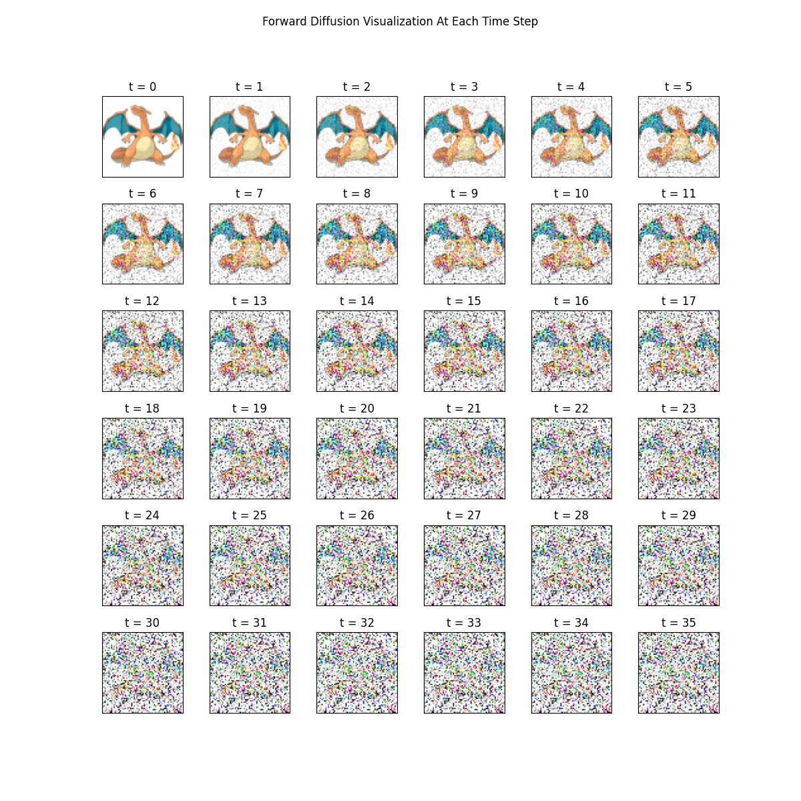
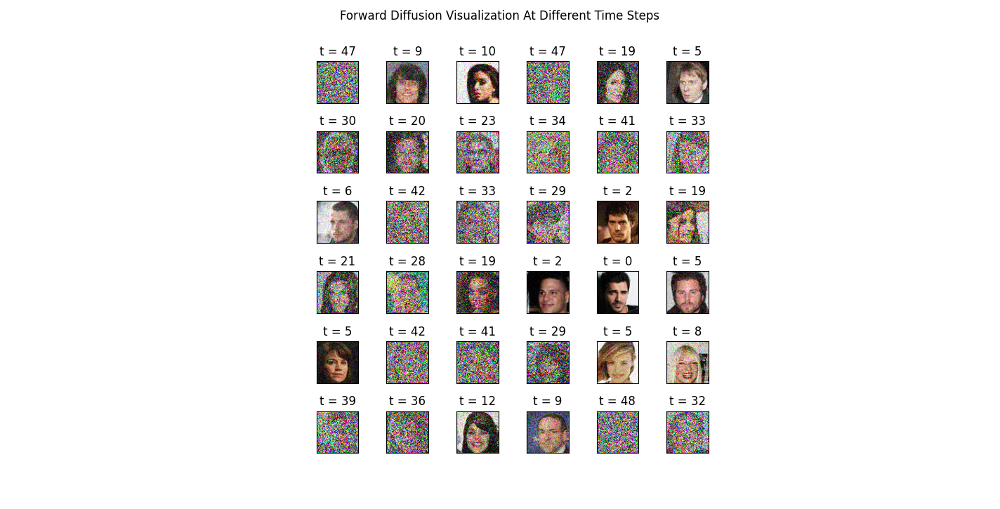

# DDPM Implementation

## Visualizations:

Here's what the forward-diffusion process of progressively adding noise at each time step looks like:

Here's what a batch of inputs to the reverse-diffusion process (U-net model)  in training look like:

